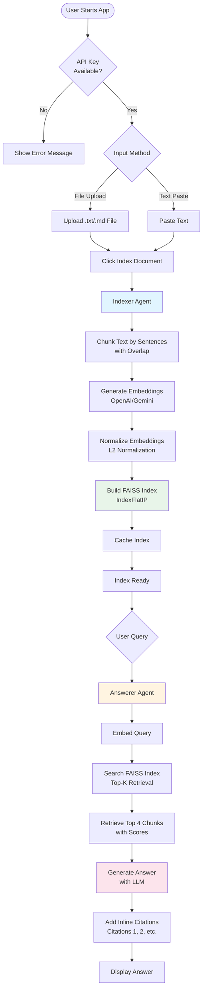

# Mini Doc-FAQ Agent (RAG + two tiny agents)

A minimal, production-clean Streamlit RAG application with two lightweight agents: an **Indexer** that processes and embeds documents, and an **Answerer** that retrieves relevant chunks and generates answers with inline citations.

## Features

- 📄 Auto-detects `.txt` and `.md` files in `/data` folder
- 🔍 Sentence-based chunking with overlap for better context preservation
- 🗂️ In-memory FAISS vector index (cosine similarity)
- 🤖 Dual LLM provider support: OpenAI or Google Gemini
- 📝 Answers with inline citations like [1], [2]
- ⚡ Cached indexing for fast reruns
- 🎨 Clean, user-friendly Streamlit UI

## Quick Start

### Prerequisites

- Python 3.10+
- API key for your chosen provider

### Installation

**For Gemini (currently configured):**
```bash
pip install streamlit faiss-cpu google-generativeai python-dotenv
```

**For OpenAI (if switching):**
```bash
pip install streamlit faiss-cpu openai python-dotenv
```

### Environment Variables

**Recommended: Use `.env` file**

1. Copy the `.env` file (or create it) in the project root
2. Add your API key:
   ```env
   GOOGLE_API_KEY=your_actual_api_key_here
   ```
   Or for OpenAI:
   ```env
   OPENAI_API_KEY=your_actual_api_key_here
   ```

**Alternative: System Environment Variables**

**Windows (PowerShell):**
```powershell
setx GOOGLE_API_KEY "your-api-key-here"
# or
setx OPENAI_API_KEY "your-api-key-here"
```

**Unix/Mac:**
```bash
export GOOGLE_API_KEY="your-api-key-here"
# or
export OPENAI_API_KEY="your-api-key-here"
```


### Configuration

Open `app.py` and set the provider at the top:

```python
PROVIDER = "gemini"  # or "openai"
```

### Running the App

1. Upload a file (`.txt` or `.md`) or paste text in the app
2. Run the app:
   ```bash
   streamlit run app.py
   ```
3. Click "Index Document" to process your content
4. Ask questions in the query box!

### Generating Architecture Flowchart

To generate a visual flowchart of the architecture:

**Option 1: Using Graphviz (recommended)**
```bash
pip install graphviz
# Also install Graphviz system package: https://graphviz.org/download/
python generate_flowchart.py
```

**Option 2: Using Matplotlib**
```bash
pip install matplotlib
python generate_flowchart.py
```

The script will generate PNG images of the architecture flowchart.

## Project Structure

```
mini-doc-faq/
├── app.py          # Main Streamlit application
├── .env            # API keys (create from .env.example or add manually)
├── data/           # Place your .txt and .md files here
└── README.md       # This file
```

## Architecture

### System Flow



### Component Details

1. **Indexer Agent**: 
   - Accepts file upload or text input
   - Chunks documents by sentences with overlap (~120 words)
   - Generates embeddings using the configured provider
   - Builds a FAISS index for fast similarity search
   - Caches index in session state

2. **Answerer Agent**:
   - Embeds the user's query
   - Retrieves top-k most similar chunks (default: 4)
   - Generates a concise answer with 2-5 bullet points
   - Includes inline citations referencing the retrieved chunks

## Models Used

**OpenAI:**
- Chat: `gpt-4o-mini`
- Embeddings: `text-embedding-3-small`

**Gemini:**
- Chat: `gemini-2.0-flash`
- Embeddings: `text-embedding-004`

## Limitations & Future Enhancements

**Current Limitations:**
- No persistence: index is rebuilt on each session (cached within session)
- Text/Markdown only: no PDF, DOCX, or other formats
- No authentication or user management
- In-memory index only (not saved to disk)

**Optional Upgrades:**
- Add PDF support with `pypdf` or `pdfplumber`
- Persist index to disk using `faiss.write_index()` and `faiss.read_index()`
- Add metadata filtering (e.g., filter by source file)
- Support for URL-based document loading
- Multi-file upload via Streamlit file uploader
- Hybrid search (vector + keyword)

## Error Handling

The app gracefully handles:
- Missing API keys (shows setup instructions)
- Empty `/data` folder (shows helpful message)
- Empty queries (ignores button click)
- File read errors (warns and continues)

## License

This is a minimal example project. Feel free to modify and extend as needed.

